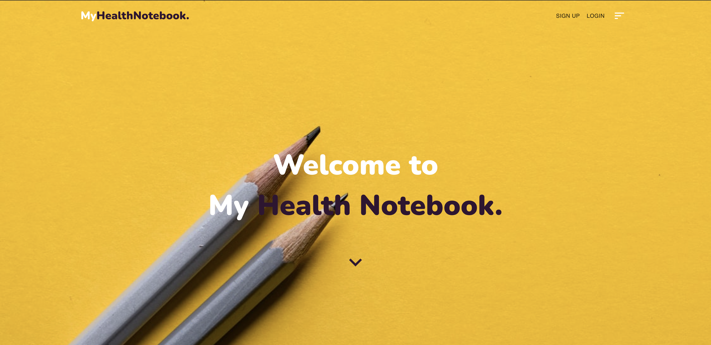
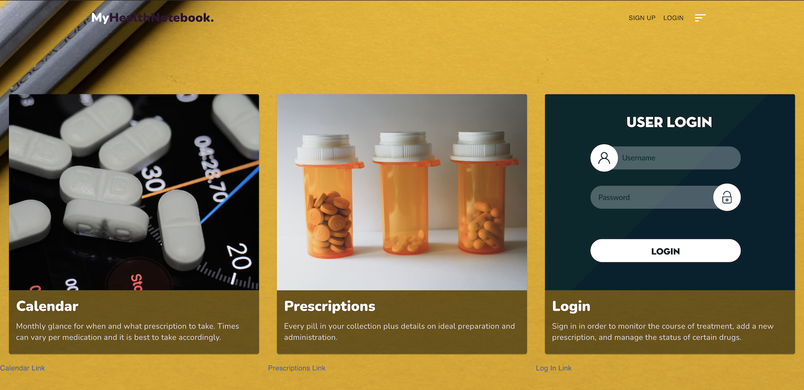

# [My Health Notebook](https://health-app-notebook.herokuapp.com/)

**My Health Notebook** is here to be your *one stop shop* for all things health related.  Easily sort through your appointments and the medications prescribed for you.  We provide you a calendar where you can jot down your appointments as well as a scheduler to help remind you when you should be taking your pills

## Usage 

When you click on **Calendar**, you can input your appointment dates in the monthly view.  In weekly view you can input your medication and the times you need to take them.  

In **Prescriptions**, you can input all your medications and their descriptions. 

## Credits
###### [Hiatt, Matthew](https://github.com/matthiatt)
###### [Evia, Flory Ann](https://github.com/fevia)
###### [DeBelen, Toni Rose](https://github.com/tonirose311)

## Links
[Heroku Deployed](https://health-app-notebook.herokuapp.com/)

[Github Repo](https://github.com/matthiatt/my_health_notebook)

## Future Development
- Pop up pill reminders
- Prescription page 
- Nearby physician search
